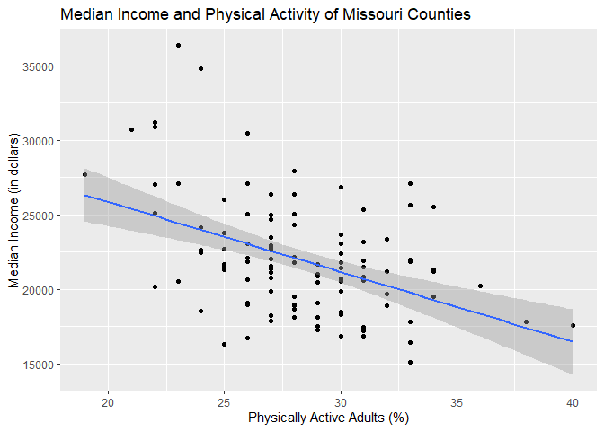
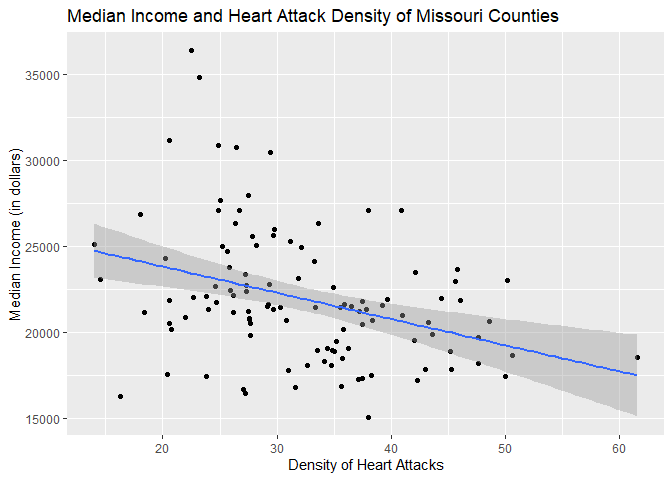
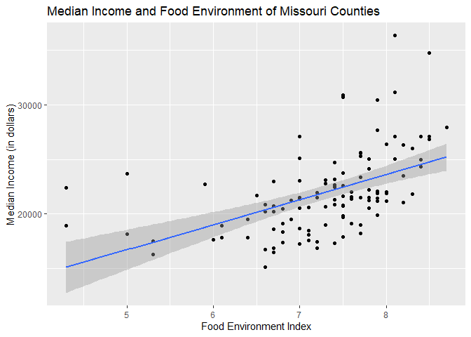
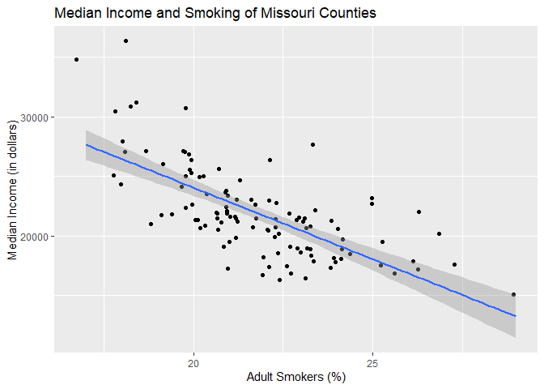
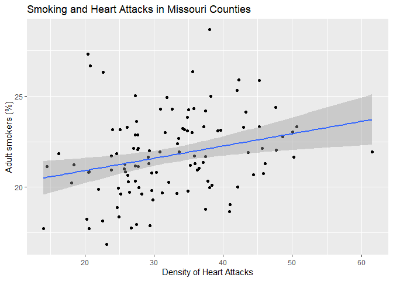
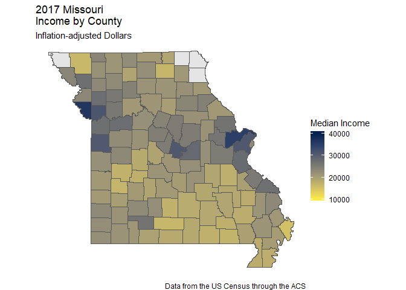
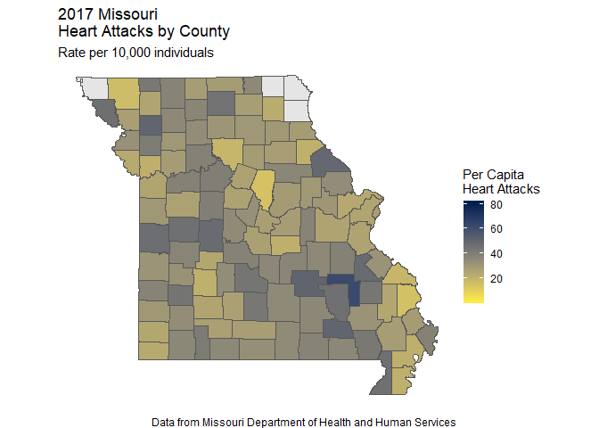

Exploratory Data
================
Nick chapman
(November 29, 2019)

## Introduction

This notebook contains the code to explore the data created in the
CleanCreate Notebook.

## Dependencies

This notebook requires a few packages:

``` r
# tidyverse packages
library(tidycensus)
library(tigris)
```

    ## To enable 
    ## caching of data, set `options(tigris_use_cache = TRUE)` in your R script or .Rprofile.

    ## 
    ## Attaching package: 'tigris'

    ## The following object is masked from 'package:graphics':
    ## 
    ##     plot

``` r
library(dplyr)
```

    ## 
    ## Attaching package: 'dplyr'

    ## The following objects are masked from 'package:stats':
    ## 
    ##     filter, lag

    ## The following objects are masked from 'package:base':
    ## 
    ##     intersect, setdiff, setequal, union

``` r
library(readr)
library(here)
```

    ## here() starts at C:/Users/nickc/OneDrive/Documents/GitHub/Chapman-Fall-2019-Sociology-Capstone

``` r
library(naniar)
library(janitor)
```

    ## 
    ## Attaching package: 'janitor'

    ## The following objects are masked from 'package:stats':
    ## 
    ##     chisq.test, fisher.test

``` r
library(sf)
```

    ## Linking to GEOS 3.6.1, GDAL 2.2.3, PROJ 4.9.3

``` r
library(Hmisc)
```

    ## Loading required package: lattice

    ## Loading required package: survival

    ## Loading required package: Formula

    ## Loading required package: ggplot2

    ## 
    ## Attaching package: 'Hmisc'

    ## The following objects are masked from 'package:dplyr':
    ## 
    ##     src, summarize

    ## The following objects are masked from 'package:base':
    ## 
    ##     format.pval, units

``` r
library(ggplot2)
```

## Load Data

This Notebook requires data that will be called from the data/clean/
folder:

``` r
county_rankings<- read_csv(here("data", "clean", "County_Rankings_Clean.csv"))
```

    ## Parsed with column specification:
    ## cols(
    ##   GEOID = col_double(),
    ##   `Adult smoking` = col_double(),
    ##   `Adult obesity` = col_double(),
    ##   `Food environment index` = col_double(),
    ##   `Physical inactivity` = col_double(),
    ##   `Access to exercise opportunities` = col_double()
    ## )

``` r
income_data<- read_csv(here("data", "clean", "MO_Income_Clean.csv"))
```

    ## Parsed with column specification:
    ## cols(
    ##   GEOID = col_double(),
    ##   Median_Income = col_double(),
    ##   `Above Average Income` = col_logical()
    ## )

``` r
population_data<- read.csv(here("data", "clean", "MO_population_Clean.csv"))
heart_attack_data<- read.csv(here("data", "clean", "Heart_Attack_Clean.csv"))
MO_counties<- read_sf(here("data", "clean", "moCounties.shp"))
Black_pop<- read.csv(here("data", "clean", "MO_Race_Clean.csv"))
```

``` r
source(here("source", "corrTable.R"))
```

``` r
heart_attack_density<- left_join(heart_attack_data, population_data, by = "GEOID")
```

``` r
heart_attack_density %>%
  mutate('Heart_Attack_Density' = ((Number_of_Heart_attacks/Population_Estimate) * 10000)) %>%
  select(-"Number_of_Heart_attacks")-> heart_attack_density
```

``` r
black_percent <- left_join(population_data, Black_pop, by= "GEOID")

black_pop_percent<- black_percent %>%
  mutate('Percent_Black' = (Number_Black/Population_Estimate)) %>%
  select(-"Population_Estimate")
```

``` r
income_rankings<- left_join(county_rankings, income_data, by = "GEOID")
heart_income_rankings <- left_join(income_rankings, heart_attack_data, by = "GEOID")
heart_income_Black_rankings <- left_join(heart_income_rankings, black_pop_percent,by = "GEOID")
heart_attack_final<- left_join(heart_income_Black_rankings, heart_attack_density, by = "GEOID")
variables_counties <- left_join(MO_counties,heart_attack_final, by= "GEOID")
```

``` r
na.omit(heart_attack_final) -> heart_attack_final 
  na.omit(variables_counties) -> counties_NA
```

``` r
correlation_table <- corrTable(heart_attack_final, coef= "pearson", listwise = TRUE, round = 3, pStar = T, `Adult smoking`, `Adult obesity`, `Food environment index`, `Physical inactivity`,`Access to exercise opportunities`, `Median_Income`, `Percent_Black`, `Heart_Attack_Density`)
```

``` r
write_csv(correlation_table, here("results", "Correlation.Table", "correlation.table.csv"))
```

``` r
ggplot(data = heart_attack_final, mapping = aes(x= `Physical inactivity`, y=Median_Income)) +
  geom_point () +
  geom_smooth(method = "lm") -> income_activity_plot

print(income_activity_plot + labs(title="Median Income and Physical Activity of Missouri Counties",
                      y="Median Income (in dollars)", x = "Physically Active Adults (%)"))
```

<!-- -->

``` r
ggsave(here("results", "plots", "income_activity_plot.png"), width = 7, height = 4, units = "in", dpi = 500)
```

``` r
ggplot(data = heart_attack_final, mapping = aes(x= `Heart_Attack_Density`, y = `Median_Income`)) +
  geom_point (position = "jitter")+
  geom_smooth(method = "lm") -> Income_Heart_attack_lm

print(Income_Heart_attack_lm + labs(title="Median Income and Heart Attack Density of Missouri Counties",
                      y="Median Income (in dollars)", x = "Density of Heart Attacks"))
```

<!-- -->

``` r
ggsave(here("results", "plots", "Income_Heart_attack_lm.png"), width = 7, height = 4, units = "in", dpi = 500)
```

``` r
ggplot(data = heart_attack_final, mapping = aes(x= `Food environment index`, y=Median_Income)) +
  geom_point () +
  geom_smooth(method = "lm") -> Food_income_plot

print(Food_income_plot + labs(title="Median Income and Food Environment of Missouri Counties",
                      y="Median Income (in dollars)", x = "Food Environment Index"))
```

<!-- -->

``` r
ggsave(here("results", "plots", "Food_income_plot.png"), width = 7, height = 4, units = "in", dpi = 500)
```

``` r
ggplot(data = heart_attack_final, mapping = aes(x= `Adult smoking`, y=Median_Income)) +
  geom_point (position = "jitter") +
  geom_smooth(method = "lm") -> smoking_income_plot

print(smoking_income_plot + labs(title="Median Income and Smoking of Missouri Counties",
                      y="Median Income (in dollars)", x = "Adult Smokers (%)"))
```

<!-- -->

``` r
ggsave(here("results", "plots", "smoking_income_plot.png"), width = 7, height = 4, units = "in", dpi = 500)
```

``` r
ggplot(data = heart_attack_final, mapping = aes(x= `Heart_Attack_Density`, y=`Adult smoking`)) +
  geom_point (position = "jitter") +
  geom_smooth(method = "lm") -> heart_smoking_plot

print(heart_smoking_plot + labs(title="Smoking and Heart Attacks in Missouri Counties",
                      y="Adult smokers (%)", x = "Density of Heart Attacks"))
```

<!-- -->

``` r
ggsave(here("results", "plots", "heart_smoking_plot.png"), width = 7, height = 4, units = "in", dpi = 500)
```

``` r
ggplot() + 
  geom_sf(variables_counties, mapping = aes())+
  geom_sf(data = counties_NA, mapping = aes(fill = `Median_Income`))+
  scale_fill_viridis_c(option = "cividis", name = "Median Income",limits = c(10000,40000), direction = -1) +
  labs(
    title = "2017 Missouri \nIncome by County",
    subtitle = "Inflation-adjusted Dollars",
    caption = "Data from the US Census through the ACS"
  )  +
  theme_void() -> GGplot_MO_2017_income
GGplot_MO_2017_income
```

<!-- -->

``` r
ggsave(width = 13.33, height = 6, units = "in",here("results", "maps", "GGplot_MO_income.png"), GGplot_MO_2017_income, dpi = 500)
```

``` r
ggplot() + geom_sf(variables_counties, mapping = aes())+
  geom_sf(data = counties_NA, mapping = aes(fill = `Heart_Attack_Density`))+
  scale_fill_viridis_c(option = "cividis", name = "Per Capita \nHeart Attacks", limits= c(1,80), direction = -1) +
  labs(
    title = "2017 Missouri \nHeart Attacks by County",
    subtitle = "Rate per 10,000 individuals",
    caption = "Data from Missouri Department of Health and Human Services"
  ) +
  theme_void() -> GGplot_MO_2017_Heart_Attacks
 GGplot_MO_2017_Heart_Attacks
```

<!-- -->

``` r
ggsave(width = 13.33, height = 6, units = "in",here("results", "maps", "GGplot_MO_Heart_Attacks.png"),  GGplot_MO_2017_Heart_Attacks, dpi = 500)
```
