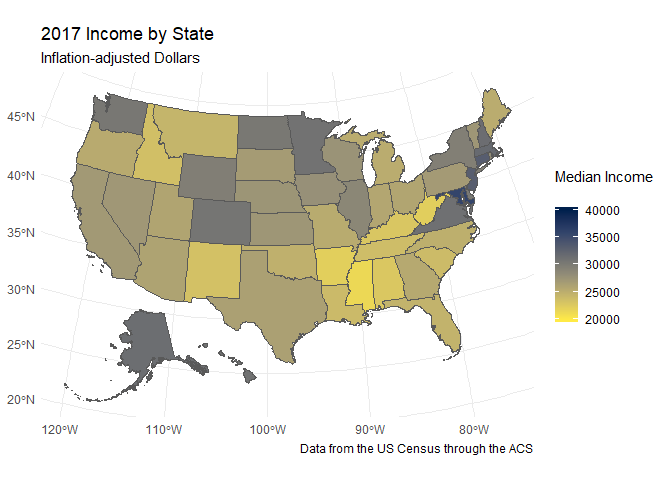

Re-mapping Cardiac Outcome Data
================
Nick chapman
(November 12, 2019)

# Introduction

This notebook contains the code to re-map cardiac outcome data from
Healthy People 2020. This calls on data from the data/raw/ folder.

## Dependencies

``` r
library(dplyr)
```

    ## 
    ## Attaching package: 'dplyr'

    ## The following objects are masked from 'package:stats':
    ## 
    ##     filter, lag

    ## The following objects are masked from 'package:base':
    ## 
    ##     intersect, setdiff, setequal, union

``` r
library(readxl)
library(purrr)
library(tidyr)
library(here)
```

    ## here() starts at C:/Users/nickc/OneDrive/Documents/GitHub/Chapman-Fall-2019-Sociology-Capstone

``` r
library(readr)
library(tigris)
```

    ## To enable 
    ## caching of data, set `options(tigris_use_cache = TRUE)` in your R script or .Rprofile.

    ## 
    ## Attaching package: 'tigris'

    ## The following object is masked from 'package:graphics':
    ## 
    ##     plot

``` r
library(tidycensus)
library(ggplot2)
library(sf)
```

    ## Linking to GEOS 3.6.1, GDAL 2.2.3, PROJ 4.9.3

``` r
library(RColorBrewer)
library(tidycensus)
```

### Load Function/Data

Using this function created by Dr. Prener, I am able to call data from
the excel file found in the data/raw/ folder:

``` r
rectangle_data_2007 <- function(state){
  
  read_excel(path = (here("data", "raw",  "HDS-2-data.xlsx")), sheet = state) %>%
    select(`...1`, `2007`) %>%
    rename(category = `...1`) %>%
    mutate(state = state) %>%
    mutate(Total = "CHD deaths per 100,000") %>%
    pivot_wider(id_cols = state, names_from = category, values_from = `2007`)
  
}
```

Using tg=his function, I will call data for each states’ CHD outcome
data:

``` r
rectangle_data_2017 <- function(state){
  
  read_excel(path = (here("data", "raw",  "HDS-2-data.xlsx")), sheet = state) %>%
    select(`...1`, `2017`) %>%
    rename(category = `...1`) %>%
    mutate(state = state) %>%
    mutate(Total = "CHD deaths per 100,000") %>%
    pivot_wider(id_cols = state, names_from = category, values_from = `2017`)
  
}
```

### Data Cleaning

Now, I want to call a table for each of the years: 2007 and 2017:

``` r
state.name %>%
  unlist() %>%
  map_df(~ rectangle_data_2007(state = .x)) -> states_2007 
```

    ## New names:
    ## * `` -> ...1
    ## * `` -> ...2
    ## * `` -> ...4
    ## * `` -> ...5
    ## * `` -> ...6
    ## * ... and 30 more problems
    ## New names:
    ## * `` -> ...1
    ## * `` -> ...2
    ## * `` -> ...4
    ## * `` -> ...5
    ## * `` -> ...6
    ## * ... and 30 more problems
    ## New names:
    ## * `` -> ...1
    ## * `` -> ...2
    ## * `` -> ...4
    ## * `` -> ...5
    ## * `` -> ...6
    ## * ... and 30 more problems
    ## New names:
    ## * `` -> ...1
    ## * `` -> ...2
    ## * `` -> ...4
    ## * `` -> ...5
    ## * `` -> ...6
    ## * ... and 30 more problems
    ## New names:
    ## * `` -> ...1
    ## * `` -> ...2
    ## * `` -> ...4
    ## * `` -> ...5
    ## * `` -> ...6
    ## * ... and 30 more problems
    ## New names:
    ## * `` -> ...1
    ## * `` -> ...2
    ## * `` -> ...4
    ## * `` -> ...5
    ## * `` -> ...6
    ## * ... and 30 more problems
    ## New names:
    ## * `` -> ...1
    ## * `` -> ...2
    ## * `` -> ...4
    ## * `` -> ...5
    ## * `` -> ...6
    ## * ... and 30 more problems
    ## New names:
    ## * `` -> ...1
    ## * `` -> ...2
    ## * `` -> ...4
    ## * `` -> ...5
    ## * `` -> ...6
    ## * ... and 30 more problems
    ## New names:
    ## * `` -> ...1
    ## * `` -> ...2
    ## * `` -> ...4
    ## * `` -> ...5
    ## * `` -> ...6
    ## * ... and 30 more problems
    ## New names:
    ## * `` -> ...1
    ## * `` -> ...2
    ## * `` -> ...4
    ## * `` -> ...5
    ## * `` -> ...6
    ## * ... and 30 more problems
    ## New names:
    ## * `` -> ...1
    ## * `` -> ...2
    ## * `` -> ...4
    ## * `` -> ...5
    ## * `` -> ...6
    ## * ... and 30 more problems
    ## New names:
    ## * `` -> ...1
    ## * `` -> ...2
    ## * `` -> ...4
    ## * `` -> ...5
    ## * `` -> ...6
    ## * ... and 30 more problems
    ## New names:
    ## * `` -> ...1
    ## * `` -> ...2
    ## * `` -> ...4
    ## * `` -> ...5
    ## * `` -> ...6
    ## * ... and 30 more problems
    ## New names:
    ## * `` -> ...1
    ## * `` -> ...2
    ## * `` -> ...4
    ## * `` -> ...5
    ## * `` -> ...6
    ## * ... and 30 more problems
    ## New names:
    ## * `` -> ...1
    ## * `` -> ...2
    ## * `` -> ...4
    ## * `` -> ...5
    ## * `` -> ...6
    ## * ... and 30 more problems
    ## New names:
    ## * `` -> ...1
    ## * `` -> ...2
    ## * `` -> ...4
    ## * `` -> ...5
    ## * `` -> ...6
    ## * ... and 30 more problems
    ## New names:
    ## * `` -> ...1
    ## * `` -> ...2
    ## * `` -> ...4
    ## * `` -> ...5
    ## * `` -> ...6
    ## * ... and 30 more problems
    ## New names:
    ## * `` -> ...1
    ## * `` -> ...2
    ## * `` -> ...4
    ## * `` -> ...5
    ## * `` -> ...6
    ## * ... and 30 more problems
    ## New names:
    ## * `` -> ...1
    ## * `` -> ...2
    ## * `` -> ...4
    ## * `` -> ...5
    ## * `` -> ...6
    ## * ... and 30 more problems
    ## New names:
    ## * `` -> ...1
    ## * `` -> ...2
    ## * `` -> ...4
    ## * `` -> ...5
    ## * `` -> ...6
    ## * ... and 30 more problems
    ## New names:
    ## * `` -> ...1
    ## * `` -> ...2
    ## * `` -> ...4
    ## * `` -> ...5
    ## * `` -> ...6
    ## * ... and 30 more problems
    ## New names:
    ## * `` -> ...1
    ## * `` -> ...2
    ## * `` -> ...4
    ## * `` -> ...5
    ## * `` -> ...6
    ## * ... and 30 more problems
    ## New names:
    ## * `` -> ...1
    ## * `` -> ...2
    ## * `` -> ...4
    ## * `` -> ...5
    ## * `` -> ...6
    ## * ... and 30 more problems
    ## New names:
    ## * `` -> ...1
    ## * `` -> ...2
    ## * `` -> ...4
    ## * `` -> ...5
    ## * `` -> ...6
    ## * ... and 30 more problems
    ## New names:
    ## * `` -> ...1
    ## * `` -> ...2
    ## * `` -> ...4
    ## * `` -> ...5
    ## * `` -> ...6
    ## * ... and 30 more problems
    ## New names:
    ## * `` -> ...1
    ## * `` -> ...2
    ## * `` -> ...4
    ## * `` -> ...5
    ## * `` -> ...6
    ## * ... and 30 more problems
    ## New names:
    ## * `` -> ...1
    ## * `` -> ...2
    ## * `` -> ...4
    ## * `` -> ...5
    ## * `` -> ...6
    ## * ... and 30 more problems
    ## New names:
    ## * `` -> ...1
    ## * `` -> ...2
    ## * `` -> ...4
    ## * `` -> ...5
    ## * `` -> ...6
    ## * ... and 30 more problems
    ## New names:
    ## * `` -> ...1
    ## * `` -> ...2
    ## * `` -> ...4
    ## * `` -> ...5
    ## * `` -> ...6
    ## * ... and 30 more problems
    ## New names:
    ## * `` -> ...1
    ## * `` -> ...2
    ## * `` -> ...4
    ## * `` -> ...5
    ## * `` -> ...6
    ## * ... and 30 more problems
    ## New names:
    ## * `` -> ...1
    ## * `` -> ...2
    ## * `` -> ...4
    ## * `` -> ...5
    ## * `` -> ...6
    ## * ... and 30 more problems
    ## New names:
    ## * `` -> ...1
    ## * `` -> ...2
    ## * `` -> ...4
    ## * `` -> ...5
    ## * `` -> ...6
    ## * ... and 30 more problems
    ## New names:
    ## * `` -> ...1
    ## * `` -> ...2
    ## * `` -> ...4
    ## * `` -> ...5
    ## * `` -> ...6
    ## * ... and 30 more problems
    ## New names:
    ## * `` -> ...1
    ## * `` -> ...2
    ## * `` -> ...4
    ## * `` -> ...5
    ## * `` -> ...6
    ## * ... and 30 more problems
    ## New names:
    ## * `` -> ...1
    ## * `` -> ...2
    ## * `` -> ...4
    ## * `` -> ...5
    ## * `` -> ...6
    ## * ... and 30 more problems
    ## New names:
    ## * `` -> ...1
    ## * `` -> ...2
    ## * `` -> ...4
    ## * `` -> ...5
    ## * `` -> ...6
    ## * ... and 30 more problems
    ## New names:
    ## * `` -> ...1
    ## * `` -> ...2
    ## * `` -> ...4
    ## * `` -> ...5
    ## * `` -> ...6
    ## * ... and 30 more problems
    ## New names:
    ## * `` -> ...1
    ## * `` -> ...2
    ## * `` -> ...4
    ## * `` -> ...5
    ## * `` -> ...6
    ## * ... and 30 more problems
    ## New names:
    ## * `` -> ...1
    ## * `` -> ...2
    ## * `` -> ...4
    ## * `` -> ...5
    ## * `` -> ...6
    ## * ... and 30 more problems
    ## New names:
    ## * `` -> ...1
    ## * `` -> ...2
    ## * `` -> ...4
    ## * `` -> ...5
    ## * `` -> ...6
    ## * ... and 30 more problems
    ## New names:
    ## * `` -> ...1
    ## * `` -> ...2
    ## * `` -> ...4
    ## * `` -> ...5
    ## * `` -> ...6
    ## * ... and 30 more problems
    ## New names:
    ## * `` -> ...1
    ## * `` -> ...2
    ## * `` -> ...4
    ## * `` -> ...5
    ## * `` -> ...6
    ## * ... and 30 more problems
    ## New names:
    ## * `` -> ...1
    ## * `` -> ...2
    ## * `` -> ...4
    ## * `` -> ...5
    ## * `` -> ...6
    ## * ... and 30 more problems
    ## New names:
    ## * `` -> ...1
    ## * `` -> ...2
    ## * `` -> ...4
    ## * `` -> ...5
    ## * `` -> ...6
    ## * ... and 30 more problems
    ## New names:
    ## * `` -> ...1
    ## * `` -> ...2
    ## * `` -> ...4
    ## * `` -> ...5
    ## * `` -> ...6
    ## * ... and 30 more problems
    ## New names:
    ## * `` -> ...1
    ## * `` -> ...2
    ## * `` -> ...4
    ## * `` -> ...5
    ## * `` -> ...6
    ## * ... and 30 more problems
    ## New names:
    ## * `` -> ...1
    ## * `` -> ...2
    ## * `` -> ...4
    ## * `` -> ...5
    ## * `` -> ...6
    ## * ... and 30 more problems
    ## New names:
    ## * `` -> ...1
    ## * `` -> ...2
    ## * `` -> ...4
    ## * `` -> ...5
    ## * `` -> ...6
    ## * ... and 30 more problems
    ## New names:
    ## * `` -> ...1
    ## * `` -> ...2
    ## * `` -> ...4
    ## * `` -> ...5
    ## * `` -> ...6
    ## * ... and 30 more problems
    ## New names:
    ## * `` -> ...1
    ## * `` -> ...2
    ## * `` -> ...4
    ## * `` -> ...5
    ## * `` -> ...6
    ## * ... and 30 more problems

``` r
state.name %>%
  unlist() %>%
  map_df(~ rectangle_data_2017(state = .x)) -> states_2017 
```

    ## New names:
    ## * `` -> ...1
    ## * `` -> ...2
    ## * `` -> ...4
    ## * `` -> ...5
    ## * `` -> ...6
    ## * ... and 30 more problems
    ## New names:
    ## * `` -> ...1
    ## * `` -> ...2
    ## * `` -> ...4
    ## * `` -> ...5
    ## * `` -> ...6
    ## * ... and 30 more problems
    ## New names:
    ## * `` -> ...1
    ## * `` -> ...2
    ## * `` -> ...4
    ## * `` -> ...5
    ## * `` -> ...6
    ## * ... and 30 more problems
    ## New names:
    ## * `` -> ...1
    ## * `` -> ...2
    ## * `` -> ...4
    ## * `` -> ...5
    ## * `` -> ...6
    ## * ... and 30 more problems
    ## New names:
    ## * `` -> ...1
    ## * `` -> ...2
    ## * `` -> ...4
    ## * `` -> ...5
    ## * `` -> ...6
    ## * ... and 30 more problems
    ## New names:
    ## * `` -> ...1
    ## * `` -> ...2
    ## * `` -> ...4
    ## * `` -> ...5
    ## * `` -> ...6
    ## * ... and 30 more problems
    ## New names:
    ## * `` -> ...1
    ## * `` -> ...2
    ## * `` -> ...4
    ## * `` -> ...5
    ## * `` -> ...6
    ## * ... and 30 more problems
    ## New names:
    ## * `` -> ...1
    ## * `` -> ...2
    ## * `` -> ...4
    ## * `` -> ...5
    ## * `` -> ...6
    ## * ... and 30 more problems
    ## New names:
    ## * `` -> ...1
    ## * `` -> ...2
    ## * `` -> ...4
    ## * `` -> ...5
    ## * `` -> ...6
    ## * ... and 30 more problems
    ## New names:
    ## * `` -> ...1
    ## * `` -> ...2
    ## * `` -> ...4
    ## * `` -> ...5
    ## * `` -> ...6
    ## * ... and 30 more problems
    ## New names:
    ## * `` -> ...1
    ## * `` -> ...2
    ## * `` -> ...4
    ## * `` -> ...5
    ## * `` -> ...6
    ## * ... and 30 more problems
    ## New names:
    ## * `` -> ...1
    ## * `` -> ...2
    ## * `` -> ...4
    ## * `` -> ...5
    ## * `` -> ...6
    ## * ... and 30 more problems
    ## New names:
    ## * `` -> ...1
    ## * `` -> ...2
    ## * `` -> ...4
    ## * `` -> ...5
    ## * `` -> ...6
    ## * ... and 30 more problems
    ## New names:
    ## * `` -> ...1
    ## * `` -> ...2
    ## * `` -> ...4
    ## * `` -> ...5
    ## * `` -> ...6
    ## * ... and 30 more problems
    ## New names:
    ## * `` -> ...1
    ## * `` -> ...2
    ## * `` -> ...4
    ## * `` -> ...5
    ## * `` -> ...6
    ## * ... and 30 more problems
    ## New names:
    ## * `` -> ...1
    ## * `` -> ...2
    ## * `` -> ...4
    ## * `` -> ...5
    ## * `` -> ...6
    ## * ... and 30 more problems
    ## New names:
    ## * `` -> ...1
    ## * `` -> ...2
    ## * `` -> ...4
    ## * `` -> ...5
    ## * `` -> ...6
    ## * ... and 30 more problems
    ## New names:
    ## * `` -> ...1
    ## * `` -> ...2
    ## * `` -> ...4
    ## * `` -> ...5
    ## * `` -> ...6
    ## * ... and 30 more problems
    ## New names:
    ## * `` -> ...1
    ## * `` -> ...2
    ## * `` -> ...4
    ## * `` -> ...5
    ## * `` -> ...6
    ## * ... and 30 more problems
    ## New names:
    ## * `` -> ...1
    ## * `` -> ...2
    ## * `` -> ...4
    ## * `` -> ...5
    ## * `` -> ...6
    ## * ... and 30 more problems
    ## New names:
    ## * `` -> ...1
    ## * `` -> ...2
    ## * `` -> ...4
    ## * `` -> ...5
    ## * `` -> ...6
    ## * ... and 30 more problems
    ## New names:
    ## * `` -> ...1
    ## * `` -> ...2
    ## * `` -> ...4
    ## * `` -> ...5
    ## * `` -> ...6
    ## * ... and 30 more problems
    ## New names:
    ## * `` -> ...1
    ## * `` -> ...2
    ## * `` -> ...4
    ## * `` -> ...5
    ## * `` -> ...6
    ## * ... and 30 more problems
    ## New names:
    ## * `` -> ...1
    ## * `` -> ...2
    ## * `` -> ...4
    ## * `` -> ...5
    ## * `` -> ...6
    ## * ... and 30 more problems
    ## New names:
    ## * `` -> ...1
    ## * `` -> ...2
    ## * `` -> ...4
    ## * `` -> ...5
    ## * `` -> ...6
    ## * ... and 30 more problems
    ## New names:
    ## * `` -> ...1
    ## * `` -> ...2
    ## * `` -> ...4
    ## * `` -> ...5
    ## * `` -> ...6
    ## * ... and 30 more problems
    ## New names:
    ## * `` -> ...1
    ## * `` -> ...2
    ## * `` -> ...4
    ## * `` -> ...5
    ## * `` -> ...6
    ## * ... and 30 more problems
    ## New names:
    ## * `` -> ...1
    ## * `` -> ...2
    ## * `` -> ...4
    ## * `` -> ...5
    ## * `` -> ...6
    ## * ... and 30 more problems
    ## New names:
    ## * `` -> ...1
    ## * `` -> ...2
    ## * `` -> ...4
    ## * `` -> ...5
    ## * `` -> ...6
    ## * ... and 30 more problems
    ## New names:
    ## * `` -> ...1
    ## * `` -> ...2
    ## * `` -> ...4
    ## * `` -> ...5
    ## * `` -> ...6
    ## * ... and 30 more problems
    ## New names:
    ## * `` -> ...1
    ## * `` -> ...2
    ## * `` -> ...4
    ## * `` -> ...5
    ## * `` -> ...6
    ## * ... and 30 more problems
    ## New names:
    ## * `` -> ...1
    ## * `` -> ...2
    ## * `` -> ...4
    ## * `` -> ...5
    ## * `` -> ...6
    ## * ... and 30 more problems
    ## New names:
    ## * `` -> ...1
    ## * `` -> ...2
    ## * `` -> ...4
    ## * `` -> ...5
    ## * `` -> ...6
    ## * ... and 30 more problems
    ## New names:
    ## * `` -> ...1
    ## * `` -> ...2
    ## * `` -> ...4
    ## * `` -> ...5
    ## * `` -> ...6
    ## * ... and 30 more problems
    ## New names:
    ## * `` -> ...1
    ## * `` -> ...2
    ## * `` -> ...4
    ## * `` -> ...5
    ## * `` -> ...6
    ## * ... and 30 more problems
    ## New names:
    ## * `` -> ...1
    ## * `` -> ...2
    ## * `` -> ...4
    ## * `` -> ...5
    ## * `` -> ...6
    ## * ... and 30 more problems
    ## New names:
    ## * `` -> ...1
    ## * `` -> ...2
    ## * `` -> ...4
    ## * `` -> ...5
    ## * `` -> ...6
    ## * ... and 30 more problems
    ## New names:
    ## * `` -> ...1
    ## * `` -> ...2
    ## * `` -> ...4
    ## * `` -> ...5
    ## * `` -> ...6
    ## * ... and 30 more problems
    ## New names:
    ## * `` -> ...1
    ## * `` -> ...2
    ## * `` -> ...4
    ## * `` -> ...5
    ## * `` -> ...6
    ## * ... and 30 more problems
    ## New names:
    ## * `` -> ...1
    ## * `` -> ...2
    ## * `` -> ...4
    ## * `` -> ...5
    ## * `` -> ...6
    ## * ... and 30 more problems
    ## New names:
    ## * `` -> ...1
    ## * `` -> ...2
    ## * `` -> ...4
    ## * `` -> ...5
    ## * `` -> ...6
    ## * ... and 30 more problems
    ## New names:
    ## * `` -> ...1
    ## * `` -> ...2
    ## * `` -> ...4
    ## * `` -> ...5
    ## * `` -> ...6
    ## * ... and 30 more problems
    ## New names:
    ## * `` -> ...1
    ## * `` -> ...2
    ## * `` -> ...4
    ## * `` -> ...5
    ## * `` -> ...6
    ## * ... and 30 more problems
    ## New names:
    ## * `` -> ...1
    ## * `` -> ...2
    ## * `` -> ...4
    ## * `` -> ...5
    ## * `` -> ...6
    ## * ... and 30 more problems
    ## New names:
    ## * `` -> ...1
    ## * `` -> ...2
    ## * `` -> ...4
    ## * `` -> ...5
    ## * `` -> ...6
    ## * ... and 30 more problems
    ## New names:
    ## * `` -> ...1
    ## * `` -> ...2
    ## * `` -> ...4
    ## * `` -> ...5
    ## * `` -> ...6
    ## * ... and 30 more problems
    ## New names:
    ## * `` -> ...1
    ## * `` -> ...2
    ## * `` -> ...4
    ## * `` -> ...5
    ## * `` -> ...6
    ## * ... and 30 more problems
    ## New names:
    ## * `` -> ...1
    ## * `` -> ...2
    ## * `` -> ...4
    ## * `` -> ...5
    ## * `` -> ...6
    ## * ... and 30 more problems
    ## New names:
    ## * `` -> ...1
    ## * `` -> ...2
    ## * `` -> ...4
    ## * `` -> ...5
    ## * `` -> ...6
    ## * ... and 30 more problems
    ## New names:
    ## * `` -> ...1
    ## * `` -> ...2
    ## * `` -> ...4
    ## * `` -> ...5
    ## * `` -> ...6
    ## * ... and 30 more problems

Now, I want to select only the `state` and `total` variables:

``` r
states_2007 %>%
  select(state, "Total") %>%
  rename("Number of CHD per 100,000" = Total) %>%
  mutate(`Number of CHD per 100,000`= as.numeric(`Number of CHD per 100,000`))-> states_2007
```

``` r
states_2017 %>%
  select(state, "Total") %>%
  rename("Number of CHD per 100,000" = Total) %>%
   mutate(`Number of CHD per 100,000`= as.numeric(`Number of CHD per 100,000`))-> states_2017
```

Now, I want to save the cleaned death per year by state data to the
data/clean/
folder:

``` r
write_csv(states_2017, here("data", "clean", "CHD_death_by_state_2017.csv"))
write_csv(states_2007, here("data", "clean", "CHD_death_by_state_2007.csv"))
```

Now, I want to join this data with the state geometries found in
`tidycensus`:

``` r
fips_codes <- select(fips_codes, state_code, state_name) %>%
  filter(!duplicated(state_name))
```

``` r
state_laea <- left_join(state_laea, fips_codes, by =c('GEOID' = 'state_code')) %>%
  filter(!GEOID %in% c("11")) %>%
  rename(state = "state_name")
```

``` r
CHD_per_state_2007 <- left_join(state_laea, states_2007, by = "state")
CHD_per_state_2017 <- left_join(state_laea, states_2017, by = "state")
```

Finally, I want to map each of the years using GGplot and save their
results:

``` r
ggplot() +
  geom_sf(data = CHD_per_state_2007, mapping = aes(fill = `Number of CHD per 100,000`))+
  scale_fill_viridis_c(option = "cividis", name = "Per Capita \nCHD Deaths", limits = c(50, 200), direction = -1) +
  labs(
    title = "2007 CHD Deaths by State",
    subtitle = "Rate per 10,000 individuals",
    caption = "Data from the CDC & HP2020"
  ) +
  theme_minimal() -> GGplot_2007_CHD
GGplot_2007_CHD
```

<!-- -->

``` r
ggsave(here("results", "maps", "GGplot_2007_CHD_Deaths.png"), GGplot_2007_CHD, dpi = 500)
```

    ## Saving 7 x 5 in image

``` r
ggplot() +
  geom_sf(data = CHD_per_state_2017, mapping = aes(fill = `Number of CHD per 100,000`))+
  scale_fill_viridis_c(option = "cividis", name = "Per Capita \nCHD Deaths",limits = c(50, 200), direction = -1) +
  labs(
    title = "2017 CHD Deaths by State",
    subtitle = "Rate per 10,000 individuals",
    caption = "Data fron the CDC & HP2020"
  ) +
  theme_minimal() -> GGplot_2017_CHD
GGplot_2017_CHD
```

<!-- -->

``` r
ggsave(here("results", "maps", "GGplot_2017_CHD_Deaths.png"), GGplot_2017_CHD, dpi = 500)
```

    ## Saving 7 x 5 in image

### Mapping National Income Data

Download and clean national income
data:

``` r
national_income <- get_acs(geography = "state", year = 2015, variable = "B19326_001", survey = "acs5")
```

    ## Getting data from the 2011-2015 5-year ACS

``` r
national_income <- national_income %>% 
  select("GEOID", "NAME", "estimate") %>%
  rename("Income" = "estimate") %>%
  filter(!GEOID %in% c("11","72"))
```

Download and clean states shapefiles:

I will load the data for the counties of Missouri, through `tigris`:

``` r
fips_codes <- select(fips_codes, state_code, state_name) %>%
  filter(!duplicated(state_name))
```

``` r
state_laea <- left_join(state_laea, fips_codes, by =c('GEOID' = 'state_code')) %>%
  filter(!GEOID %in% c("11")) %>%
  rename(state = "state_name")
```

Now, I want to join the shapefile data with the income data:

``` r
income_national <- left_join(state_laea, national_income, by = "GEOID")
```

Now, I want to create a map to display these data:

``` r
ggplot() +
  geom_sf(data = income_national, mapping = aes(fill = `Income`))+
  scale_fill_viridis_c(option = "cividis", name = "Median Income \n",limits = c(20000,40000), direction = -1) +
  labs(
    title = "2017 Income by State",
    subtitle = "Inflation-adjusted Dollars",
    caption = "Data from the US Census through the ACS"
  ) +
  theme_minimal() -> GGplot_2017_income
GGplot_2017_income
```

<!-- -->
